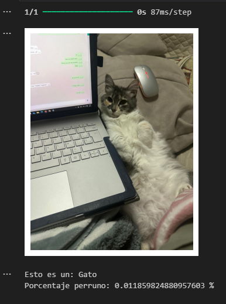

# Exercises

## 🌅Artwork_Artists
In this exercise and having as a dataset a csv donwloaded from kaggle, I haved responded the following questions

    1. Which artist in this data set lived the longest?
    2. Who are the top 10 artists by the number of artworks?
    3. Which artist is created the most artwork by total surface area?
    4. Did any artists have artwork acquired during their lifetime?
    
## 🐱 Cat_Dog_Project🐶
In this exercise I created a simple image classifier just for fun. You can see a picture of the result here!

